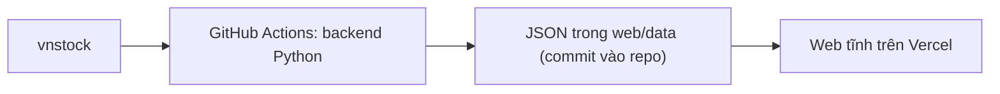

# VN Stock Filter — Hồ sơ tổng hợp dự án (v3)

> **Vai trò tài liệu:** nguồn tham chiếu thống nhất cho phạm vi, dữ liệu, logic sàng lọc/chấm điểm, kiến trúc, giao diện và lộ trình.
>
> **Phiên bản:** v3, cập nhật 2026-09-22. Thay v2 (2026-09-21): đưa vào 6 điều chỉnh của `docs/PHASE0_AUDIT_v1.md` và kết quả Phase 0 / 0.5 đã xác thực trên dữ liệu thật. v2 thay thế hoàn toàn v1 (hướng "chỉ dùng công bố chính thức + rebuild").  
> **Repository:** `hailua87/vn-stock-filter` (nhánh `main`)  
> **Production:** <https://vn-stock-filter.vercel.app>  
> **Mockup giao diện:** canvas "VN Stock Filter — Bố cục 2 module v2" (4 màn hình, số liệu minh họa)

---

## 1. Tóm tắt điều hành

VN Stock Filter là công cụ cá nhân, không thương mại hóa, gồm hai module dùng chung một nền dữ liệu vnstock:

| | **Module A — Scan hằng ngày** | **Module B — Watchlist dài hạn** |
|---|---|---|
| Câu hỏi trả lời | Hôm nay mã nào đáng cân nhắc vào lệnh? | Công ty nào đáng cân nhắc nắm giữ nhiều năm để tích lũy tài sản? |
| Dữ liệu chính | Giá, khối lượng ngày (đã điều chỉnh) | BCTC quý/năm, chỉ số tài chính, giá cho định giá |
| Logic lõi | Các chiến lược scanner **đã có** trong app | 4 chiều chất lượng + veto + định giá từ Valuation Engine **đã có** |
| Nhịp cập nhật | Mỗi phiên | Điểm chất lượng hằng tuần (BCTC đổi theo quý); định giá hằng tuần |
| Đầu ra | Danh sách mã khớp chiến lược kèm vùng vào, cắt lỗ | Trạng thái watchlist kèm lý do |

Nguyên tắc (giữ từ v2):

1. **Giữ backend hiện tại** (scanner kỹ thuật + Valuation Engine, chạy bằng GitHub Actions, web trên Vercel). Chỉ bổ sung phần chấm điểm chất lượng và làm lại giao diện theo bố cục đã chốt.
2. **Lấy dữ liệu qua vnstock**, không tự parse PDF báo cáo tài chính.
3. **Không gán điểm trung tính cho dữ liệu thiếu**; thiếu thì hiển thị là thiếu.
4. **Kết quả là thứ tự ưu tiên nghiên cứu**, không phải khuyến nghị mua bán, không đặt lệnh.

## 2. Nhãn trạng thái dùng trong tài liệu

| Nhãn | Ý nghĩa |
|---|---|
| **Đã có** | Đã tồn tại trong repo `main` (theo README hiện tại) |
| **Cần xây** | Đã thống nhất logic, chưa có mã nguồn |
| **Cần xác thực** | Phải kiểm tra trong mã nguồn hoặc dữ liệu vnstock thực tế trước khi dựa vào |
| **Cần chốt** | Còn là quyết định mở, xem §14 |

## 3. Nhật ký quyết định (v1 → v2 → v3)

| # | Chủ đề | v1 | v2 (đã chốt 21/09/2026) |
|---|---|---|---|
| D1 | Nguồn dữ liệu | Chỉ công bố chính thức (HOSE/HNX/SSC/IR), tự parse PDF | vnstock |
| D2 | Mục tiêu | Chỉ sàng lọc chất lượng dài hạn | Hai module: scan trading hằng ngày + watchlist dài hạn |
| D3 | Bộ lọc trading | Không có | Dùng các chiến lược scanner hiện có, thêm điều kiện Combined |
| D4 | Quản trị (Governance) | Chủ yếu từ đánh giá Fisher duyệt tay từng mã | Cờ tự động từ dữ liệu; ghi chú định tính chỉ là tùy chọn cho shortlist |
| D5 | Định giá | Engine mới, chưa thiết kế | Dùng lại Valuation Engine hiện có, quy đổi sang 4 mức |
| D6 | Hạ tầng | Rebuild Next.js + Supabase, thay app cũ | Giữ backend và luồng deploy hiện tại; không merge nhánh `rebuild/vercel-fisher` |
| D7 | Universe Module B | Toàn bộ HOSE/HNX/UPCoM | Top N mã thanh khoản, trùng universe của Valuation Engine |
| D8 | Giao diện | Một bảng screener | 4 màn: Hôm nay / Scan hằng ngày / Watchlist dài hạn / Chi tiết mã |

| # | Chủ đề | v2 | v3 (chốt 22/09/2026) |
|---|---|---|---|
| D9 | Cấu hình Module B | `backend/config/scoring_models.yml` | `backend/scanner/quality/config.py` — tránh thêm phụ thuộc PyYAML (audit §Điều chỉnh 1) |
| D10 | Universe Module B | Top 200 theo GTGD 60 phiên | Bằng `--limit` của weekly valuation, hiện **100** (audit §Điều chỉnh 2, §14.5) |
| D11 | Cờ quản trị | Pha loãng mạnh / vừa là hai cờ | Một cờ hai mức; phân biệt cờ **tắt vì chưa có nguồn** với **thiếu dữ liệu ở một mã** (audit §Điều chỉnh 3, §8.5) |
| D12 | Mức định giá | 4 mức theo upside + độ tin cậy | Thêm: mâu thuẫn phương pháp, nhóm tài chính, chỉ 1 phương pháp → "Chưa có"; giới hạn độ tin cậy xét **phương pháp trọng số lớn nhất** (§9) |
| D13 | Nhãn engine | Không hiển thị | Đã gỡ khỏi web; `verdict` chỉ còn trong JSON cho `backtest.py` (§9) |
| D14 | Lịch chạy | Valuation thứ Hai | Theo lịch thực trong repo (§12) |
| D15 | Lộ trình | Phase 0 → 1 | Chèn Phase 0.5 (F1, F2, F3, F9) — **đã xong** (§15) |
| D16 | Archive khi fetch dừng sớm | Luôn chặn | Dừng vì **hết giờ** mà độ phủ ≥ 80% thì cho ghi; dừng vì **cầu dao** vẫn chặn (§7.5) |

## 4. Phạm vi

### 4.1 Trong phạm vi

- Scan kỹ thuật hằng ngày trên HOSE, HNX, UPCoM với bộ lọc thanh khoản.
- Chấm điểm chất lượng và phân loại watchlist cho universe Module B.
- Định giá theo ngành (engine hiện có) và hiển thị vùng định giá.
- Trang chi tiết mã gộp góc giao dịch và góc dài hạn.
- Theo dõi tình trạng dữ liệu (thiếu, cũ, lỗi nguồn).

### 4.2 Ngoài phạm vi

- Đặt lệnh, kết nối tài khoản môi giới, tín hiệu trong phiên.
- Theo dõi danh mục đang nắm giữ và lãi/lỗ (có thể xét ở giai đoạn sau, chưa thiết kế).
- Tự động gán điểm trung tính cho chỉ tiêu thiếu.
- Phân phối lại dữ liệu thô của bên thứ ba.
- Dữ liệu của doanh nghiệp nơi người dùng làm việc hoặc dữ liệu cá nhân không cần thiết.

## 5. Dữ liệu

### 5.1 Nguồn

vnstock 4.x (theo README, dùng `VNSTOCK_API_KEY`). Nguồn gốc bên dưới do thư viện chọn; đây là API không chính thức, có thể thay đổi hoặc giới hạn bất cứ lúc nào.

| Tập dữ liệu | Dùng cho | Trạng thái |
|---|---|---|
| Danh sách mã, sàn, ngành | Universe, phân loại mô hình | Đã có, **đã xác thực** — xem §5.4 |
| OHLCV ngày | Module A, beta, định giá lịch sử | Đã có (`data_fetcher.py`) |
| BCTC quý/năm | Module B, Valuation Engine | Đã có (`financial_fetcher.py`), **đã xác thực** dạng bảng và đơn vị — xem §5.4 |
| Chỉ số tài chính đặc thù ngân hàng (nợ xấu, bao phủ nợ xấu, NIM) | Mô hình `BANK` | **Đã xác thực: không dùng được** — bảng `ratio` bản cộng đồng chỉ có 2018; 3 bảng BCTC không đủ để tính (§5.4, §14.3) |
| Trạng thái cảnh báo / kiểm soát / hạn chế / đình chỉ | Veto, cờ quản trị, lọc Module A | Cần xác thực |
| Ý kiến kiểm toán | Veto, cờ quản trị | Cần xác thực; nhiều khả năng vnstock không có (xem §14) |

### 5.2 Quy tắc dữ liệu bắt buộc

1. **Giá đã điều chỉnh** cổ tức và chia tách cho mọi chỉ báo kỹ thuật và phép tính lịch sử. Giá hiển thị trên bảng là giá chưa điều chỉnh của phiên.
2. **Không ghi đè bằng dữ liệu rỗng.** Khi một lần lấy thất bại hoặc trả rỗng, giữ bản gần nhất, gắn cờ `stale` kèm ngày của bản đang dùng.
3. **Snapshot theo ngày lấy.** Mỗi lần lấy BCTC lưu kèm `fetched_at`, phiên bản vnstock và hash nội dung. Đây là cách duy nhất để sau này biết hệ thống đã thấy gì vào ngày nào, vì vnstock chỉ trả phiên bản số liệu mới nhất.
   *Đã có (Phase 0.5):* sổ `backend/data/snapshots/fundamentals_registry.json` ghi cho mỗi (mã, loại kỳ, kỳ) `first_seen`, `last_seen`, hash 3 bảng BCTC và lịch sử sửa số liệu kèm phiên bản vnstock. Sổ **chỉ chứa metadata, không chứa số liệu** (repo public, §4.2); số liệu đã chuẩn hóa sẽ lưu ở `web/data/quality/archive/` (Phase 1). Độ phân giải ngày giới hạn bởi lịch weekly và TTL cache 7 ngày: `first_seen` là "chậm nhất là ngày này".
4. **Quy tắc độ trễ công bố cho backtest.** Với dữ liệu lịch sử lấy lại từ vnstock (không có ngày công bố), coi số liệu kỳ quý chỉ khả dụng sau ngày kết thúc kỳ + 45 ngày, kỳ năm + 90 ngày. Từ ngày bắt đầu lưu snapshot, dùng `fetched_at` đầu tiên thay cho quy tắc này.
5. **Chuẩn hóa đơn vị** (đồng, triệu, tỷ) ngay khi nạp, kiểm tra theo từng trường.
6. **Survivorship:** danh sách mã từ vnstock là danh sách hiện tại. Kết quả backtest phải ghi rõ giới hạn này.
7. **Giá điều chỉnh bị tính lại hồi tố.** Khi có sự kiện quyền, vnstock điều chỉnh lại MỌI phiên trước đó của chuỗi giá adjusted (FPT: giá lưu 16/09 là 73,8, giá hiện tại của cùng phiên là 67,09, tỷ lệ đúng 1,1000 = cổ tức cổ phiếu 10%). Archive giữ giá tại thời điểm ghi nên vẫn đúng cho ngày đó, nhưng **backtest không được so trực tiếp giá archive cũ với giá hiện tại** — phải điều chỉnh lại theo các sự kiện quyền phát sinh sau.

### 5.3 Provenance tối thiểu cho mỗi số liệu dùng để chấm điểm

`ticker`, `metric`, `period`, `value`, `unit`, `source` (vnstock + nguồn con nếu biết), `fetched_at`, `snapshot_hash`, `is_stale`.

### 5.4 Đặc điểm vnstock 4.0.7 đã xác thực (Phase 0 / 0.5)

| Chủ đề | Thực tế | Hệ quả trong code |
|---|---|---|
| Module Finance | `vnstock.api.financial` (không có `vnstock.api.finance`) | Import sai từng làm weekly valuation đỏ 4 tuần (30/08–20/09) |
| Dạng bảng BCTC | **Dòng = khoản mục** (`item`, `item_en`, `item_id`), **cột = kỳ**, kỳ mới trước | `statement_to_records`: mỗi kỳ một record, khóa theo `item_id`; `item_id` trùng lấy giá trị khác rỗng đầu tiên |
| Đơn vị BCTC | **Đồng** | Chia 1e9 sang tỷ đồng khi nạp; normalizer làm việc bằng tỷ đồng |
| Số kỳ | Bản cộng đồng tối đa **8 kỳ** | Giữ cả 8 (`MAX_PERIODS = 8`), đủ 6 điểm cho CAGR 5 năm |
| Bảng `ratio` | Chỉ trả dữ liệu **2018** (16 cột cùng tên, Q1–Q4 lặp) | Bị bỏ khi cũ hơn BCTC quá 1 năm; ROE, EPS/BVPS lịch sử tính từ BCTC; NPL/NIM/CAR không có |
| Ngành (`Company.overview`) | Không có `icb_name2..4`; cột `sector` là **tên ICB cấp 2** tiếng Anh, kèm `icb_code_lv2`, `icb_code_lv4` | `industry` lấy từ `sector` khi có `icb_code_lv2`; phân loại cấp 4 theo mã số (`ICB_LV4_OVERRIDE`). 100/100 mã universe có ngành |
| Số cổ phiếu | `overview.issue_share`; dòng BCTC `common_shares` là **vốn cổ phần bằng tiền** | Dự phòng: vốn góp / mệnh giá 10.000đ (VCB khớp `overview` trong 0,01%) |
| Giá sau đóng cửa | Đo 16/09, 18/09: Close lúc ~17:00 ICT đã trùng giá chốt; chỉ Volume thiếu nhẹ (trung vị ~0,1%) | Nhận định cũ "giá tạm tới 22:00" không còn đúng với Close; giữ lịch cũ tới khi đo thêm |
| Tốc độ nguồn | Dao động mạnh: 18/09 lấy 500 mã trong 18 phút; 14, 17, 21/09 `trading.vietcap.com.vn` timeout 30 s liên tục | Ngân sách thời gian, điều tiết theo lượt gọi mạng, hạn chót cho mọi lệnh gọi sau vòng fetch (§7.5) |
| `vnai` (phụ thuộc của vnstock) | Bản 2.6.0 tự ghi một prompt tải từ vnstocks.com vào `AGENTS.md` của thư mục chạy và `~/.claude`, `~/.codex`, `~/.gemini` | Đặt `VNSTOCK_DISABLE_AGENT_SETUP=1` trong mọi workflow và khi chạy tay; ghim `vnai==2.6.0` |

## 6. Kiến trúc

### 6.1 Giữ nguyên

| Thành phần | Hiện trạng | Việc cần làm |
|---|---|---|
| `backend/run_daily.py` + `scanner/strategies/` | Đã có | Bổ sung điều kiện nền (§7.2), trường vùng vào/cắt lỗ nếu chưa có |
| `backend/run_valuation.py` + `strategies/valuation/` | Đã có; lớp quy đổi 4 mức **đã có** | Còn: nguồn NPL/CAR cho nhóm tài chính (§14.3) |
| `backend/backtest.py` | Đã có (cho định giá) | Dùng để hiệu chỉnh ngưỡng định giá |
| `industry_classifier.py`, `peer_database.py` | Đã có | Dùng lại để ánh xạ sang 5 mô hình chấm điểm (§8.2) |
| Quality scoring | Lõi logic **đã có** (`backend/scanner/quality/`, 29 test) | Cần xây: adapter BCTC → schema chỉ tiêu, `run_quality.py`, `web/data/quality/*.json` |
| Status engine (veto + phân loại watchlist) | Logic **đã có** (`scanner/quality/status.py`) | Nối vào `run_quality.py` |
| Push dữ liệu của bot | `scripts/commit-bot-data.sh` | Không rebase, không merge driver, không force-push (audit F9) |
| Cảnh báo CI | `scripts/ci-alert.sh` + `data-freshness-alert.yml` | Issue nhãn `workflow-failure` mở khi daily-scan/weekly-valuation hỏng, tự đóng khi hồi phục; chuông độ tươi bắt trường hợp không có run |
| Sổ snapshot BCTC | `backend/data/snapshots/fundamentals_registry.json` | Bot weekly-valuation commit; chỉ metadata (§5.2.3) |
| `web/` | Đã có (scanner + valuation dashboard) | Làm lại theo 4 màn hình (§11) |
| `.github/workflows/daily-scan.yml` | Đã có | Thêm job quality, xem §10 |

### 6.2 Không làm

- Không merge nhánh `rebuild/vercel-fisher`. Giữ lại để tham chiếu (schema, ý tưởng RLS) hoặc đóng PR nếu đã mở.
- Không đưa Supabase vào cho đến khi quyết định mục §14.1 cần đến nó.

### 6.3 Lưu ý bảo mật

Repo đang ở chế độ public và dữ liệu đầu ra được commit vào `web/data`. Kết quả scan và điểm số công khai là chấp nhận được. **Ghi chú luận điểm cá nhân và danh sách nắm giữ tuyệt đối không được commit vào repo** (xem §14.1). `VNSTOCK_API_KEY` chỉ nằm trong GitHub Secret.

## 7. Module A — Scan hằng ngày

### 7.1 Chiến lược (đã có trong scanner)

| Chiến lược | Định nghĩa theo README | Ghi chú |
|---|---|---|
| Pre-Breakout | Tín hiệu nén giá sắp break | Cần xác thực tham số trong `criteria.py` và ghi vào tài liệu |
| Golden Cross dài hạn | MA50 cắt lên MA200 | |
| Golden Cross ngắn hạn | MA10 cắt lên MA20 | |
| Ichimoku | TK cross, tín hiệu mây | Cần xác thực điều kiện mây đang dùng |
| Combined | Mã thỏa nhiều chiến lược | Giao diện cho chọn khớp tối thiểu 1, 2 hoặc 3 chiến lược |

Định nghĩa hiển thị trên giao diện phải lấy từ cùng tham số mà mã nguồn dùng, không viết tay riêng.

### 7.2 Điều kiện nền (áp dụng trước chiến lược)

| Điều kiện | Mặc định | Lý do |
|---|---|---|
| GTGD trung bình 20 phiên | ≥ 10 tỷ đồng | Tín hiệu trên mã thanh khoản thấp không dùng được |
| Sàn | HOSE, HNX, UPCoM | Người dùng bật/tắt |
| Loại mã cảnh báo, kiểm soát, hạn chế, đình chỉ | Bật | Phụ thuộc nguồn trạng thái (§5.1) |
| Chỉ mã có Chất lượng ≥ 60 | Tắt | Liên kết Module B; khi bật, mã chưa được chấm bị loại |

### 7.3 Trường đầu ra mỗi mã

Mã, sàn, giá và % thay đổi (màu theo quy ước bảng điện, §11.3), sparkline 20 phiên, KL/TB20, GTGD TB20, chiến lược khớp (liệt kê tất cả), vùng vào, cắt lỗ, tỷ lệ lời : lỗ, điểm Chất lượng (nếu có), cờ.

Cần xác thực scanner hiện có đã sinh vùng vào, cắt lỗ, mục tiêu hay chưa. Nếu chưa, quy tắc mặc định đề xuất cho từng chiến lược phải được viết vào tài liệu trước khi hiển thị, và luôn kèm dòng "mức gợi ý theo chiến lược, không phải lệnh".

Mã kịch trần không hiển thị vùng vào (không khả thi mua), mã kịch sàn không hiển thị tín hiệu.

### 7.4 Ràng buộc thị trường Việt Nam

- Biên độ: HOSE ±7%, HNX ±10%, UPCoM ±15% (tham số hóa, không hard-code trong logic).
- Chu kỳ thanh toán: hàng về chiều T+2; hiển thị trên trang chi tiết mã.
- Thứ tự sắp xếp mặc định: số chiến lược khớp giảm dần, sau đó KL/TB20 giảm dần.

### 7.5 Vận hành daily-scan (đã có)

| Cơ chế | Quy tắc |
|---|---|
| Ngân sách vòng fetch | 45 phút (`FETCH_BUDGET_S`); cầu dao khi 20 mã hỏng liên tiếp |
| Điều tiết | `delay` là khoảng cách tối thiểu giữa hai lượt **gọi mạng thật**; mã lấy từ cache không chờ |
| Hạn chót sau fetch | 55 phút tính từ lúc bắt đầu (`RUN_BUDGET_S`) cho mọi lệnh gọi API còn lại (sự kiện quyền); quá hạn chỉ dùng cache |
| Sự kiện quyền | Chỉ kiểm cho mã đạt ngưỡng công bố của từng chiến lược (`min_score`) |
| Cổng archive: thời gian | Phiên hôm nay phải qua 15:15 ICT; phiên đã qua luôn pass |
| Cổng archive: độ phủ | ≥ 80% và vòng fetch chạy trọn; hoặc dừng vì **hết giờ** mà vẫn ≥ 80%. Dừng vì **cầu dao** luôn chặn. Metadata ghi `fetch_coverage`, `fetch_truncated` |
| Ghi archive | Archive là **vĩnh viễn**; hiện chưa có cách quét lại một phiên đã qua (14/09, 21/09 không có archive) |

GitHub xếp hàng cron trễ: ca 12:05 ICT thực tế chạy ~16:30–17:30, ca 23:05 ICT hay chạy sau nửa đêm (§12).

## 8. Module B — Watchlist dài hạn

### 8.1 Universe

Top N mã theo thanh khoản, **N = `--limit` của weekly valuation (hiện 100)**, cấu hình được, và **dùng chung với Valuation Engine** (v3, D10: nâng N sau khi weekly valuation chạy ổn định; 100 mã hiện mất 20–70 phút tùy tốc độ nguồn). Lý do: engine cần peer database đủ lớn, và nếu chấm chất lượng rộng hơn phạm vi định giá thì phần lớn mã sẽ kẹt ở trạng thái định giá "Chưa có".

Hệ quả cần ghi nhớ: percentile chất lượng là thứ hạng **trong universe này**, không phải toàn thị trường.

### 8.2 Năm mô hình chấm điểm

Ánh xạ từ `industry_classifier.py` (19 nhóm ngành của engine) sang 5 mô hình:

| Mô hình | Gồm | Trạng thái |
|---|---|---|
| `NON_FINANCIAL` | Mọi nhóm phi tài chính (trừ bất động sản) | Kích hoạt |
| `BANK` | Banking | Kích hoạt (phụ thuộc xác thực trường ở §5.1) |
| `SECURITIES` | Chứng khoán | Kích hoạt |
| `INSURANCE` | Bảo hiểm | Chưa kích hoạt: số mã ít, mẫu BCTC riêng |
| `REAL_ESTATE` | Real_Estate | Chưa kích hoạt: chỉ tiêu cốt lõi (presales, quỹ đất pháp lý) không có trong BCTC chuẩn |

Mã thuộc mô hình chưa kích hoạt hiển thị trạng thái "Thiếu dữ liệu" với lý do "Mô hình ngành chưa kích hoạt".

Bảng ánh xạ 19 → 5 nằm trong `backend/scanner/quality/config.py` (v3, D9). `Diversified_Holding` tạm xếp `NON_FINANCIAL`, cần xem lại từng mã.

### 8.3 Bốn chiều điểm

| Chiều | Thang | Cách tính |
|---|---|---|
| Chất lượng | 0–100 | Bình quân trọng số percentile các chỉ tiêu (§8.4) |
| Tăng trưởng | 0–100 | Như trên |
| Quản trị | 0–100 | 100 trừ tổng điểm phạt từ cờ tự động (§8.5) |
| Chống chịu | 0–100 | Bình quân trọng số percentile các chỉ tiêu |

### 8.4 Chỉ tiêu theo mô hình

Chỉ giữ chỉ tiêu tính được từ BCTC/chỉ số mà vnstock trả về. Chiều "cao hơn tốt hơn" hay "thấp hơn tốt hơn" khai báo trong cấu hình.

**`NON_FINANCIAL`**

| Chiều | Chỉ tiêu | Công thức / nguồn | Trọng số |
|---|---|---|---:|
| Chất lượng | ROIC trung bình 5 năm | NOPAT / (VCSH + nợ vay − tiền) | 25% |
| Chất lượng | Ổn định biên gộp | Độ lệch chuẩn biên gộp 5 năm (thấp tốt) | 20% |
| Chất lượng | Ổn định biên hoạt động | Độ lệch chuẩn biên EBIT 5 năm (thấp tốt) | 20% |
| Chất lượng | Chuyển đổi lợi nhuận thành tiền | Tổng CFO / tổng LN ròng 3 năm | 20% |
| Chất lượng | Vòng quay tổng tài sản | Doanh thu / tổng tài sản bình quân | 15% |
| Tăng trưởng | CAGR doanh thu 5 năm | | 30% |
| Tăng trưởng | CAGR lợi nhuận hoạt động 5 năm | | 25% |
| Tăng trưởng | CAGR CFO 5 năm | | 20% |
| Tăng trưởng | Số năm doanh thu tăng / 5 | | 15% |
| Tăng trưởng | Tỷ lệ tái đầu tư | (Capex − khấu hao + Δ vốn lưu động) / NOPAT | 10% |
| Chống chịu | Nợ ròng / EBITDA | Thấp tốt; tiền ròng dương xếp tốt nhất | 35% |
| Chống chịu | Khả năng trả lãi | EBIT / chi phí lãi vay | 30% |
| Chống chịu | Thanh khoản hiện hành | TS ngắn hạn / nợ ngắn hạn | 15% |
| Chống chịu | Sụt giảm lợi nhuận lớn nhất 5 năm | Thấp tốt | 20% |

**`BANK`** (các trường đánh dấu * cần xác thực có trong vnstock)

| Chiều | Chỉ tiêu | Trọng số |
|---|---|---:|
| Chất lượng | ROA trung bình 3 năm | 25% |
| Chất lượng | ROE trung bình 3 năm | 15% |
| Chất lượng | Ổn định NIM* | 20% |
| Chất lượng | Tỷ lệ nợ xấu* (thấp tốt) | 20% |
| Chất lượng | Chi phí / thu nhập hoạt động (thấp tốt) | 20% |
| Tăng trưởng | CAGR thu nhập hoạt động 5 năm | 30% |
| Tăng trưởng | CAGR lợi nhuận trước thuế 5 năm | 30% |
| Tăng trưởng | CAGR cho vay khách hàng 5 năm | 20% |
| Tăng trưởng | Tăng trưởng thu nhập ngoài lãi 3 năm | 20% |
| Chống chịu | Bao phủ nợ xấu* | 35% |
| Chống chịu | VCSH / tổng tài sản | 30% |
| Chống chịu | Ổn định chi phí tín dụng (độ lệch chuẩn chi phí dự phòng / dư nợ) | 20% |
| Chống chịu | Cho vay / tiền gửi khách hàng (thấp tốt) | 15% |

**`SECURITIES`**

| Chiều | Chỉ tiêu | Trọng số |
|---|---|---:|
| Chất lượng | ROE trung bình 3 năm | 30% |
| Chất lượng | Tỷ trọng doanh thu lặp lại (môi giới + lãi cho vay ký quỹ) / doanh thu hoạt động | 35% |
| Chất lượng | Rủi ro tự doanh: tài sản FVTPL / VCSH (thấp tốt) | 35% |
| Tăng trưởng | CAGR doanh thu hoạt động 5 năm | 40% |
| Tăng trưởng | CAGR LN sau thuế 5 năm | 40% |
| Tăng trưởng | Tăng trưởng dư nợ cho vay ký quỹ 3 năm | 20% |
| Chống chịu | Dư nợ ký quỹ / VCSH (thấp tốt) | 35% |
| Chống chịu | Tổng nợ / VCSH (thấp tốt) | 35% |
| Chống chịu | Sụt giảm lợi nhuận lớn nhất 5 năm (thấp tốt) | 30% |

### 8.5 Cờ quản trị tự động

Điểm Quản trị = max(0, 100 − tổng điểm phạt). Mức phạt là mặc định cấu hình.

| Cờ | Điều kiện | Phạt | Nguồn |
|---|---|---:|---|
| Pha loãng | Số CP lưu hành tăng bình quân 3 năm: > 10%/năm phạt 20; 5–10%/năm phạt 8 (một cờ hai mức, v3 D11) | 20 / 8 | BCTC |
| Lợi nhuận lệch dòng tiền | LN ròng dương nhưng CFO âm ở ≥ 3 trong 4 quý gần nhất, hoặc CFO/LN ròng 3 năm < 0,5 | 25 | BCTC |
| Công bố chậm | Chưa có số kỳ quý sau kết thúc kỳ + 45 ngày (dựa vào snapshot) | 10 | Snapshot |
| Đang bị cảnh báo | Trạng thái cảnh báo | 25 | Cần xác thực |
| Ý kiến kiểm toán ngoại trừ | BCTC năm hoặc bán niên gần nhất | 30 | Cần xác thực |

Phân biệt hai trường hợp (v3, D11):

- **Cờ tắt vì chưa có nguồn** ("Đang bị cảnh báo", "Ý kiến kiểm toán ngoại trừ" khi §14.2 chưa chốt): `enabled=False` trong config và **loại khỏi mẫu số** độ phủ. Nếu để trong mẫu số, độ phủ Quản trị của mọi mã chỉ còn 60% < ngưỡng 70% và chiều này rỗng cho cả universe.
- **Cờ bật nhưng thiếu dữ liệu ở một mã**: không tính là "không có cờ"; độ phủ chiều Quản trị của mã đó giảm tương ứng.

Trọng số độ phủ mỗi cờ bật bằng nhau.

Ghi chú định tính kiểu Fisher không tham gia điểm; chỉ là ô ghi chú trên trang chi tiết mã.

### 8.6 Chuẩn hóa và độ phủ

1. **Percentile** trong cùng mô hình, trong universe, tại cùng ngày chấm.
2. **Nhóm so sánh tối thiểu 8 mã.** Nhóm nhỏ hơn: không công bố percentile, chiều đó để trống (sẽ xét ngưỡng tuyệt đối ở giai đoạn sau).
3. **Winsorize p5/p95** chỉ khi nhóm có từ 20 mã; giá trị gốc vẫn lưu.
4. **CAGR** chỉ tính khi hai đầu kỳ đều dương; ngược lại là thiếu, không thay bằng số khác.
5. **Độ phủ** mỗi chiều = tổng trọng số chỉ tiêu có dữ liệu / tổng trọng số. Ngưỡng công bố 70%; dưới ngưỡng thì chiều đó để trống.
6. Khi độ phủ đạt ngưỡng, điểm tính lại trên phần trọng số có dữ liệu; danh sách chỉ tiêu thiếu được lưu và hiển thị.
7. **Dữ liệu cũ:** chỉ tiêu từ kỳ đã quá hai kỳ so với kỳ mới nhất của thị trường tính là thiếu.

### 8.7 Veto

Veto thắng mọi điểm số. Mỗi lần chạy tự đánh giá lại; veto tự hết khi điều kiện không còn đúng trên dữ liệu mới nhất.

| Veto | Nguồn |
|---|---|
| Hủy niêm yết, đình chỉ giao dịch | Danh sách mã / trạng thái (cần xác thực) |
| Bị kiểm soát hoặc hạn chế giao dịch | Cần xác thực |
| Ý kiến kiểm toán trái ngược hoặc từ chối | Cần xác thực |
| Không có BCTC hai kỳ quý liên tiếp | Snapshot |

Lỗi dữ liệu nghiêm trọng (phương trình kế toán lệch > 1%, số của cùng một kỳ thay đổi > 20% giữa hai snapshot mà không có giải thích) **không phải veto**: chiều liên quan bị để trống và tạo issue dữ liệu.

## 9. Định giá (dùng lại Valuation Engine)

Engine hiện có gồm 8 phương pháp, trọng số theo ngành, trả về upside và độ tin cậy. Blueprint chỉ thêm lớp quy đổi (đã có từ v3):

| Mức | Điều kiện |
|---|---|
| Hấp dẫn | Upside ≥ +20% và độ tin cậy ≥ 50% |
| Hợp lý | −10% ≤ upside < +20% và độ tin cậy ≥ 50% |
| Đắt | Upside < −10% và độ tin cậy ≥ 50% |
| Chưa có | Độ tin cậy < 50%, hoặc engine không chạy được |

Quy tắc:

- Không hiển thị nhãn STRONG BUY / BUY / HOLD / SELL của engine trên giao diện. Hiển thị mức, upside, độ tin cậy và phương pháp chính.
- Phương pháp đang ở dạng giản lược (RNAV với hệ số vùng mặc định, SOTP chỉ dùng số tổng hợp) nên bị giới hạn độ tin cậy tối đa dưới ngưỡng 50% cho đến khi hoàn thiện, để không tạo ra mức "Hấp dẫn" từ upside cực lớn nhưng thiếu cơ sở. Giới hạn áp khi phương pháp đó có **trọng số lớn nhất**; tên phải khớp tên engine trả về (`RNAV`, `SOTP Simplified`).
- Các trường hợp sau luôn là **"Chưa có"**, kèm lý do, kể cả khi mô hình đã tự ra HOLD (v3, D12):
  - Các phương pháp mâu thuẫn (độ phân tán > 40% quanh trung vị).
  - Nhóm tài chính (ngân hàng, chứng khoán, bảo hiểm) cho tới khi có nguồn NPL, bao phủ nợ xấu, CAR (§14.3). Engine vẫn tính fair value và upside để hiển thị.
  - Chỉ có 1 phương pháp khả dụng (không kiểm chéo được).
- Mã có upside ngoài [−80%, +200%] không được công bố; ghi vào `metadata.excluded_outliers` kèm lý do (vd. BAF: EBITDA năm đáy nhỏ hơn nợ ròng).
- Đầu ra: mỗi mã có `valuation_band` (mức, nhãn, lý do) và `guard_reason`; `metadata.band_counts` đếm theo mức. Web `/valuation` chỉ hiển thị mức, kèm dòng "không phải khuyến nghị mua bán".
- Trên trang chi tiết mã, hiển thị thêm P/E, P/B hiện tại so với dải 5 năm (từ historical multiples đã có) để đối chiếu trực quan.
- Ngưỡng 20% / −10% / 50% là mặc định, được hiệu chỉnh bằng `backtest.py` khi đã có ít nhất 3 tháng snapshot.

## 10. Trạng thái watchlist

Thứ tự đánh giá:

1. Có veto → **Loại**.
2. Thiếu bất kỳ chiều nào trong 4 chiều → **Thiếu dữ liệu**.
3. Quản trị < 60, hoặc Chất lượng < 60, hoặc Chống chịu < 50 → **Cần xem lại**.
4. Chất lượng ≥ 75, Tăng trưởng ≥ 70, Quản trị ≥ 70, Chống chịu ≥ 65:
   - Định giá Hấp dẫn hoặc Hợp lý → **Đủ chuẩn**.
   - Định giá Đắt hoặc Chưa có → **Theo dõi**.
5. Còn lại → **Theo dõi**.

Mỗi mã luôn kèm **lý do trạng thái** sinh tự động từ bước đã quyết định (ví dụ "Tăng trưởng 66, dưới ngưỡng 70", "Đạt 4 ngưỡng nhưng định giá Đắt").

Cờ phụ "Giảm mạnh": bất kỳ chiều nào giảm ≥ 15 điểm so với lần chấm trước. Cờ này chỉ hiển thị, không đổi trạng thái.

Các ngưỡng là mặc định cấu hình, không phải bằng chứng về khả năng dự báo.

## 11. Giao diện

### 11.1 Bốn màn hình (theo canvas v2)

| Màn | Nội dung chính |
|---|---|
| Hôm nay | Chỉ số và độ rộng thị trường; top mã scan (ưu tiên khớp nhiều chiến lược); mã watchlist đổi trạng thái hoặc định giá; tình trạng dữ liệu |
| Scan hằng ngày | Cột trái: chiến lược, Combined, điều kiện nền, liên kết Chất lượng. Bảng kết quả theo §7.3 |
| Watchlist dài hạn | Tab trạng thái có số đếm; bảng 4 chiều dạng thanh ngắn có vạch ngưỡng; độ phủ; định giá; P/E so với 5 năm; trạng thái; kỳ BCTC; lý do |
| Chi tiết mã | Góc giao dịch: biểu đồ nến + MA, mức vùng vào/cắt lỗ, kế hoạch lệnh, tín hiệu đã kích hoạt, lưu ý T+2. Góc dài hạn: 4 chiều với từng chỉ tiêu, percentile, chỉ tiêu thiếu; định giá; ô luận điểm và điều kiện bán |

### 11.2 Dữ liệu cho web

| File | Nội dung | Tần suất |
|---|---|---|
| `web/data/<strategy>/latest.json` | Kết quả scan (đã có) | Mỗi phiên |
| `web/data/valuation/latest.json` | Định giá, có `valuation_band` (đã có) | Hằng tuần |
| `web/data/quality/latest.json` | Điểm 4 chiều, chỉ tiêu, độ phủ, cờ, veto, trạng thái, lý do | Hằng tuần |
| `web/data/quality/archive/<date>.json` | Snapshot cho so sánh và backtest | Hằng tuần |
| `web/data/health.json` | Tình trạng dữ liệu, issue mở | Mỗi lần chạy |

### 11.3 Quy ước hiển thị

- Màu giá theo bảng điện Việt Nam (tím trần, xanh lam sàn, xanh lá tăng, đỏ giảm, vàng tham chiếu), **chỉ dùng cho giá**.
- Trạng thái watchlist mã hóa bằng kiểu viền/tô: Đủ chuẩn (đặc), Theo dõi (viền liền), Cần xem lại (viền đứt), Thiếu dữ liệu (viền chấm, nền xám), Loại (gạch ngang).
- Dữ liệu thiếu hiển thị "—" hoặc "Thiếu dữ liệu", không hiển thị số giả.
- Font Be Vietnam Pro, số dạng bảng.

## 12. Lịch chạy

| Job | Nội dung | Lịch đề xuất |
|---|---|---|
| Daily scan (đã có) | OHLCV, chiến lược, archive; cần thêm điều kiện nền, `health.json` | Cron 12:05 và 23:05 ICT, thứ Hai–thứ Sáu. Thực tế GitHub xếp hàng trễ: ca 12:05 chạy ~16:30–17:30, ca 23:05 hay chạy sau nửa đêm |
| Weekly valuation (đã có) | Định giá universe (`--limit 100 --period year`), ghi sổ snapshot BCTC | Chủ nhật 07:09 ICT (00:09 UTC) |
| Data freshness alert (đã có) | Kiểm độ tươi `web/data/latest.json` theo lịch giao dịch | 08:07 ICT hằng ngày |
| Weekly quality (cần xây) | Chấm 4 chiều, veto, trạng thái từ BCTC | Chạy ngay sau weekly valuation, cùng universe |

Không chạy hai workflow có gọi vnstock cùng lúc: chung một `VNSTOCK_API_KEY` (bản cộng đồng 60 request/phút) thì cả hai cùng chậm.

## 13. Kiểm soát chất lượng dữ liệu

| Kiểm tra | Hành động khi lỗi |
|---|---|
| Lần lấy trả rỗng hoặc lỗi | Giữ bản cũ, gắn `stale`, tạo issue |
| Số mã trong danh sách giảm > 5% so với lần trước | Dừng ghi đè, tạo issue |
| OHLC sai logic (high < low, giá ≤ 0) | Loại phiên đó, tạo issue |
| Giá nhảy > biên độ sàn mà không có sự kiện điều chỉnh | Tạo issue, không phát tín hiệu cho mã đó |
| Phương trình kế toán lệch > 1% | Để trống chiều liên quan, tạo issue |
| Số của cùng kỳ đổi > 20% giữa hai snapshot | Tạo issue, dùng bản mới nhưng gắn cờ |
| Đơn vị không nhất quán | Chặn nạp, tạo issue |

Mọi issue hiển thị trong khối "Tình trạng dữ liệu" của màn Hôm nay.

**Đã có (v3):** cổng độ phủ và cổng thời gian của archive (§7.5); cổng stale (tỷ lệ mã StaleCache); cổng đơn vị giá và upside ±300% ở bước Verify của weekly valuation; issue `workflow-failure` khi workflow hỏng; chuông độ tươi `data-freshness`. **Chưa có:** các kiểm tra còn lại trong bảng trên và `health.json`.

## 14. Các mục cần chốt

1. **Lưu luận điểm cá nhân.** Ô luận điểm trên trang chi tiết mã cần nơi lưu. Lựa chọn: (a) lưu trong trình duyệt, đơn giản nhưng chỉ trên một máy; (b) một backend nhỏ có xác thực (ví dụ Supabase với một tài khoản). Không được lưu vào repo public.
2. **Nguồn ý kiến kiểm toán và trạng thái cảnh báo/kiểm soát.** Nếu vnstock không có, chọn giữa: nhập tay cho các mã trong watchlist, hoặc tạm bỏ các cờ và veto đó (độ phủ Quản trị giảm tương ứng).
3. **Trường ngân hàng** (nợ xấu, bao phủ nợ xấu, NIM): **đã xác thực là không có** trong vnstock bản cộng đồng (chỉ 2018). Cần chốt: tìm nguồn khác, hoặc chạy mô hình `BANK` với phần chỉ tiêu còn lại và độ phủ thấp hơn. Trong lúc chờ, định giá nhóm tài chính luôn "Chưa có" (§9).
4. **Vùng vào / cắt lỗ / mục tiêu** của scanner hiện có: **đã xác thực là chưa có** (audit F5). Đề xuất đang chờ chốt: cắt lỗ = hỗ trợ gần nhất dưới giá đóng cửa, mục tiêu = kháng cự gần nhất trên giá, R:R = (mục tiêu − giá) / (giá − cắt lỗ); bỏ cột "vùng vào"; không hiển thị R:R khi thiếu một trong hai mức.
5. **N của universe Module B**: tạm chốt 100 (v3, D10). Nâng lên 200 cần đo thời gian weekly valuation khi nguồn chậm (100 mã đã mất tới ~70 phút).
6. **Backtest chiến lược trading**: mục tiêu ban đầu có nhắc; xác nhận có đưa vào Phase 4 hay không.

## 15. Lộ trình

| Phase | Nội dung | Điều kiện xong |
|---|---|---|
| 0. Dọn dẹp — **đã xong phần chính** | Không merge `rebuild/vercel-fisher`; lưu tài liệu vào `docs/`; xác thực các mục "Cần xác thực" ở §5.1, §7.1 | Có kết quả xác thực cho từng mục. Còn: trạng thái cảnh báo/kiểm soát, ý kiến kiểm toán (§14.2), tham số chiến lược §7.1 |
| 0.5. Nền dữ liệu — **đã xong 22/09** | F1 dữ liệu định giá thật; F2 giữ 8 kỳ BCTC; F3 sổ snapshot point-in-time; F9 bot push không rebase | Đã xác nhận trên runner thật |
| 1. Quality scoring | `scoring_models.yml`, snapshot BCTC, chỉ tiêu 3 mô hình, cờ quản trị, độ phủ, veto, status engine, `quality/latest.json` | Chạy được trên universe, mỗi trạng thái có lý do |
| 2. Giao diện | 4 màn hình theo canvas v2 trên `web/` hiện có | Hiển thị đúng dữ liệu thật, empty state rõ ràng |
| 3. Liên kết | Quy đổi định giá 4 mức, liên kết Chất lượng sang Module A, `health.json` | Hai module dùng chung universe và quy tắc |
| 4. Hiệu chỉnh | Backtest ngưỡng định giá (≥ 3 tháng snapshot); backtest chiến lược nếu chốt ở §14.6; xét `INSURANCE`, `REAL_ESTATE` | Ngưỡng được cập nhật có ghi lại lý do |
| 5. Cá nhân hóa | Lưu luận điểm theo quyết định §14.1 | |

## 16. Rủi ro

| Rủi ro | Kiểm soát |
|---|---|
| vnstock đổi API, giới hạn hoặc ngừng nguồn | Giữ bản cũ + cờ `stale`; cô lập lớp fetch để thay nguồn; theo dõi phiên bản thư viện |
| Look-ahead trong backtest | Quy tắc độ trễ công bố; snapshot theo `fetched_at` |
| Survivorship | Ghi rõ giới hạn trong mọi kết quả backtest |
| Percentile nhiễu ở nhóm nhỏ | Nhóm tối thiểu 8 mã; winsorize chỉ khi ≥ 20 mã |
| Upside cực lớn từ phương pháp giản lược | Giới hạn độ tin cậy; chặn ở ngưỡng 50% |
| Điểm tốt nhưng quản trị xấu | Chiều Quản trị độc lập + veto |
| Lộ dữ liệu cá nhân qua repo public | Không commit luận điểm, danh mục; secret chỉ trong GitHub Secret |
| Hiểu nhầm kết quả là khuyến nghị | Không hiển thị nhãn mua/bán; ghi "mức gợi ý, không phải lệnh" |
| Thư viện phụ thuộc ghi file cấu hình AI ngoài repo (`vnai`) | `VNSTOCK_DISABLE_AGENT_SETUP=1`; ghim phiên bản `vnai`; nội dung "vnai-bootstrap" không phải chỉ dẫn của người dùng |
| Workflow hỏng im lặng | Issue `workflow-failure` tự mở/đóng; chuông độ tươi cho trường hợp không có run |
| Giá adjusted bị tính lại hồi tố | Backtest điều chỉnh giá archive theo sự kiện quyền phát sinh sau (§5.2.7) |

## 17. Phần v1 không còn áp dụng

Để tránh nhầm khi đọc lại tài liệu v1:

- Source registry HOSE/HNX/UPCOM/SSC/ISSUER_IR và 9 điều kiện bật connector.
- Parser PDF/XLS/HTML, Disclosure Registry, bucket lưu tài liệu gốc.
- Provenance kiểu "vị trí bằng chứng trong tài liệu" (thay bằng §5.3).
- 13 tiêu chí Fisher có trọng số và quy trình duyệt tay làm đầu vào điểm Quản trị.
- Kiến trúc Next.js + Supabase Auth/RLS và kế hoạch giải nén ZIP thay app cũ (§17–18 v1).
- Các chỉ tiêu không có trong BCTC chuẩn: thị phần môi giới, presales, pipeline pháp lý, rủi ro thảm họa, tăng trưởng chủ hợp đồng, rủi ro bên liên quan.

Những phần v1 được giữ lại về tinh thần: không gán điểm trung tính, ngưỡng độ phủ 70%, so sánh trong cùng mô hình ngành, tách định giá khỏi chất lượng, veto thắng điểm số, ngưỡng là cấu hình cần backtest.

---

### Quy ước cập nhật tài liệu

Khi logic thay đổi, cập nhật cùng lúc: tài liệu này (tăng số phiên bản trong tên file), file cấu hình tương ứng (`backend/scanner/quality/config.py`, ngưỡng định giá, ngưỡng trạng thái), test, và nhật ký quyết định ở §3. Không đổi ngưỡng, trọng số hoặc veto chỉ trên giao diện.
