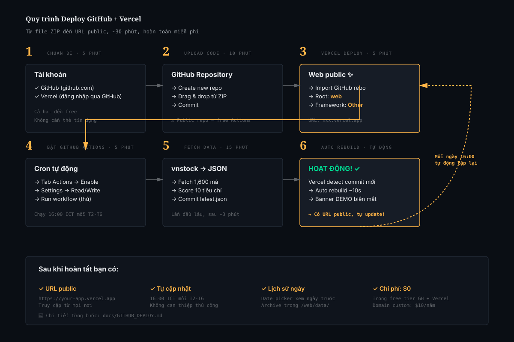

# Hướng dẫn Deploy & Publish qua GitHub

> Hướng dẫn này dẫn bạn đi từ **chưa có gì** đến **có URL web hoạt động + tự cập nhật hằng ngày miễn phí**.
> Thời gian: **30-45 phút** cho lần đầu.



## Tổng quan kiến trúc

```
┌─────────────────┐        ┌─────────────────┐        ┌─────────────────┐
│   Máy của bạn   │  push  │     GitHub      │  cron  │     Vercel      │
│  (code/local)   │ ─────> │   (mã nguồn)    │ ─────> │  (web public)   │
└─────────────────┘        └─────────────────┘        └─────────────────┘
                                  │                            ▲
                                  │ GitHub Actions chạy        │
                                  │ run_daily.py 16:00 ICT     │
                                  │ commit latest.json         │
                                  └─────── auto rebuild ───────┘
```

**Bạn cần:**
- ✅ Tài khoản GitHub (miễn phí)
- ✅ Tài khoản Vercel (miễn phí, login bằng GitHub)
- ✅ Trình duyệt
- ❌ Không cần thẻ tín dụng
- ❌ Không cần biết Git (nhưng nếu biết sẽ nhanh hơn)

---

## PHẦN 1: Chuẩn bị tài khoản

### 1.1 Tạo tài khoản GitHub

Nếu đã có, bỏ qua phần này.

1. Vào **https://github.com**
2. Click **"Sign up"** ở góc trên phải
3. Nhập email, password, username (vd: `nguyenvana`)
4. Verify email qua link gửi về hộp thư

### 1.2 Tạo tài khoản Vercel

1. Vào **https://vercel.com**
2. Click **"Sign Up"**
3. Chọn **"Continue with GitHub"** (đăng nhập bằng GitHub vừa tạo)
4. Authorize Vercel truy cập GitHub của bạn
5. Vercel hỏi tên team — chọn **"Personal Account"** (free)

> 💡 **Tại sao dùng Vercel mà không phải GitHub Pages?**
> Cả 2 đều free, nhưng Vercel có:
> - Build nhanh hơn (~10 giây vs 1-2 phút)
> - Custom domain dễ hơn
> - Tự rebuild khi data thay đổi
> - Edge network rộng hơn → load nhanh ở VN

---

## PHẦN 2: Upload code lên GitHub

Có **2 cách** — chọn 1 trong 2:

### Cách A: Qua giao diện web (DỄ — không cần cài Git)

#### A1. Tạo repository mới

1. Đăng nhập GitHub
2. Góc trên phải, click icon **`+`** → **"New repository"**
3. Điền form:
   - **Repository name**: `vn-breakout-scanner` (hoặc tên khác)
   - **Description**: "Vietnamese stock pre-breakout scanner" (tuỳ chọn)
   - **Public** hoặc **Private**:
     - 🟢 **Public** = miễn phí GitHub Actions (2,000 phút/tháng) → **đề xuất**
     - 🔴 **Private** = chỉ 500 phút/tháng GitHub Actions free tier
   - **KHÔNG** tick "Add a README file"
   - **KHÔNG** tick "Add .gitignore"
   - **KHÔNG** chọn license
4. Click **"Create repository"**

GitHub sẽ hiện màn hình "Quick setup" với các lệnh Git. **Bỏ qua phần đó**.

#### A2. Upload files

1. Ở trang repo vừa tạo, click link **"uploading an existing file"** (giữa trang)

   Hoặc URL: `https://github.com/[username]/vn-breakout-scanner/upload/main`

2. Giải nén file `vn-breakout-scanner.zip` ra một thư mục trên máy
3. Mở thư mục đó
4. **Chọn tất cả files VÀ thư mục bên trong** (không phải chọn thư mục `vn-breakout-scanner`, mà các thứ bên trong nó)
5. Kéo thả vào vùng upload trên GitHub

   > ⚠️ **Lưu ý quan trọng**: GitHub web có thể **không upload được file ẩn** (như `.github/`, `.gitignore`). Xem phần [Khắc phục](#khắc-phục-thiếu-github-workflows) bên dưới nếu gặp.

6. Đợi upload xong (1-3 phút tuỳ kết nối)
7. Cuộn xuống cuối trang:
   - **Commit message**: "Initial commit"
   - Để mặc định "Commit directly to main"
   - Click **"Commit changes"**

#### A3. Khắc phục thiếu .github/workflows

Nếu sau khi upload bạn không thấy thư mục `.github` (vì web bỏ qua thư mục ẩn), làm thêm:

1. Click **"Add file"** → **"Create new file"**
2. Trong ô tên file, gõ: `.github/workflows/daily-scan.yml`

   > Lưu ý: gõ đúng có dấu chấm đầu `/` — GitHub sẽ tự tạo thư mục lồng nhau khi bạn gõ `/`

3. Copy nội dung từ file `daily-scan.yml` đã giải nén dán vào
4. Cuộn xuống → "Commit new file"
5. Lặp lại cho `.github/workflows/ci.yml`
6. Lặp lại cho `.gitignore`

### Cách B: Qua Git command line (NHANH hơn nếu đã quen)

```bash
# Vào thư mục project sau khi giải nén
cd vn-breakout-scanner

# Khởi tạo repo
git init
git add .
git commit -m "Initial commit"

# Tạo repo trên GitHub trước (theo bước A1), rồi:
git remote add origin https://github.com/[username]/vn-breakout-scanner.git
git branch -M main
git push -u origin main
```

GitHub có thể hỏi username/password — dùng **Personal Access Token** thay vì password:
- Settings → Developer settings → Personal access tokens → Generate new token
- Scope: `repo` (full control)
- Copy token, dùng làm password khi git push

### 2.4 Kiểm tra upload thành công

Quay lại trang repo, đảm bảo có đủ:

```
✓ backend/         (thư mục)
✓ web/             (thư mục)
✓ docs/            (thư mục)
✓ scripts/         (thư mục)
✓ .github/         (THƯ MỤC ẨN - rất quan trọng!)
  └── workflows/
       ├── daily-scan.yml
       └── ci.yml
✓ .gitignore       (file ẩn)
✓ README.md
✓ QUICKSTART.md
✓ Dockerfile
✓ docker-compose.yml
✓ vercel.json
✓ LICENSE
```

Đặc biệt **xác minh `.github/workflows/daily-scan.yml`** đã có — đây là file kích hoạt cron tự động.

---

## PHẦN 3: Deploy lên Vercel

### 3.1 Import project

1. Đăng nhập **https://vercel.com**
2. Trang chủ → click **"Add New..."** → **"Project"**
3. Vercel hiển thị danh sách GitHub repos của bạn
4. Tìm `vn-breakout-scanner` → click **"Import"**

   > Nếu không thấy repo, click "Adjust GitHub App Permissions" để cấp quyền cho Vercel truy cập repo này.

### 3.2 Cấu hình build

Vercel hiển thị màn hình "Configure Project":

| Cấu hình | Giá trị |
|---|---|
| **Project Name** | `vn-breakout-scanner` (tự chỉnh nếu muốn) |
| **Framework Preset** | **Other** (rất quan trọng — không chọn Next.js) |
| **Root Directory** | Click "Edit" → chọn `web` → Continue |
| **Build Command** | Để trống (Vercel sẽ tự dùng default) |
| **Output Directory** | Để mặc định `.` (dot) |
| **Install Command** | Để trống |

### 3.3 Deploy

Click **"Deploy"** màu đen ở dưới.

Vercel sẽ:
1. Clone repo (10-15 giây)
2. Build (5-10 giây — vì là static, rất nhanh)
3. Deploy lên global edge network

Sau ~30 giây, bạn thấy:

```
🎉 Congratulations! Your project has been deployed.
```

Và URL như: `https://vn-breakout-scanner-abc123.vercel.app`

**Click vào URL để xem trang web của bạn đã chạy.**

### 3.4 (Tuỳ chọn) Đổi tên domain Vercel

Mặc định Vercel cho tên gồm chuỗi random như `abc123`. Bạn có thể bỏ:

1. Trong project → tab **"Settings"** → **"Domains"**
2. Tên hiện tại có dạng `vn-breakout-scanner-abc123.vercel.app`
3. Click "Edit" → đổi thành `vn-breakout-scanner.vercel.app` (nếu chưa có ai dùng)

Hoặc custom domain của riêng bạn (cần mua $10/năm) — xem [DEPLOYMENT.md](DEPLOYMENT.md).

---

## PHẦN 4: Bật GitHub Actions (cron tự động)

Sau khi upload code, GitHub Actions **chưa chạy tự động** với repo mới — cần bật:

### 4.1 Enable Actions

1. Vào repo GitHub
2. Click tab **"Actions"** trên thanh menu
3. Nếu thấy thông báo:
   > "Workflows aren't being run on this fork"

   Click **"I understand my workflows, go ahead and enable them"**

4. Nếu thấy thông báo:
   > "Get started with GitHub Actions"

   Click **"set up a workflow yourself"** không cần — workflow đã có trong `.github/workflows/`. Refresh trang sau 1 phút.

### 4.2 Cấp quyền cho Actions commit

Workflow `daily-scan.yml` sẽ commit file `latest.json` trở lại repo. Cần cấp quyền:

1. Vào **Settings** của repo (tab cuối cùng)
2. Bên trái: **Actions** → **General**
3. Cuộn xuống phần **"Workflow permissions"**
4. Chọn **"Read and write permissions"**
5. Tick **"Allow GitHub Actions to create and approve pull requests"**
6. Click **"Save"**

### 4.3 Test chạy thử

Đừng đợi đến chiều mai. Chạy thử ngay:

1. Vào tab **Actions**
2. Bên trái, click workflow **"Daily Scan"**
3. Bên phải, click nút **"Run workflow"** (xám)
4. Để mặc định branch `main` → click **"Run workflow"** (xanh)
5. Sau 5-10 giây, refresh — sẽ thấy workflow đang chạy (icon vàng quay)

Click vào workflow đang chạy để xem log realtime.

### 4.4 Xử lý lỗi khi chạy lần đầu

**Lỗi thường gặp 1: `vnstock` fail vì rate limit**

```
HTTPError: 429 Too Many Requests
```

Đợi 30 phút rồi chạy lại. Hoặc giảm concurrency trong `backend/scanner/data_fetcher.py`:
```python
fetch_universe(..., max_workers=2, delay=0.5)
```

**Lỗi thường gặp 2: Không có quyền commit**

```
Permission denied to github-actions[bot]
```

Quay lại bước 4.2 → cấp Read and write permissions.

**Lỗi thường gặp 3: Timeout 15 phút**

Lần đầu fetch 1,600 mã có thể tốn 15-20 phút. Mở `.github/workflows/daily-scan.yml`, đổi:
```yaml
timeout-minutes: 30  # tăng từ 15 lên 30
```

Push lại lên GitHub, chạy lại.

### 4.5 Verify thành công

Sau 5-15 phút, workflow xong với icon **xanh ✓**. Kiểm tra:

1. Vào tab **Code** của repo
2. Mở thư mục `web/data/`
3. Phải có file `latest.json` mới (timestamp commit ~vài phút trước)
4. Mở file → kiểm tra `metadata.demo` **không phải** `true`

Quay lại URL Vercel của bạn → refresh → dữ liệu mới hiển thị, **không còn banner DEMO**.

🎉 **Hoàn tất!** Hệ thống của bạn:
- Có URL public truy cập mọi nơi
- Tự cập nhật hằng ngày 16:00 ICT mỗi phiên T2-T6
- Hoàn toàn miễn phí trong giới hạn free tier

---

## PHẦN 5: Xác minh deployment đúng

### Checklist cuối cùng

Đi qua từng item một:

- [ ] **URL Vercel mở được** trên trình duyệt
- [ ] **Tiêu đề "Bắt sóng trước khi giá break"** hiển thị đúng
- [ ] **Banner DEMO ĐỎ đã biến mất** (sau khi GitHub Actions chạy xong lần đầu)
- [ ] **Date picker hiển thị ngày hôm nay** (phiên giao dịch gần nhất)
- [ ] **Bảng tín hiệu có dữ liệu** thật (≥ 10 mã)
- [ ] **GitHub Actions tab** hiện workflow xanh ✓
- [ ] **File `web/data/latest.json` trong GitHub** có timestamp mới
- [ ] **Status bar hiện "LIVE"** không phải "ARCHIVE" cho ngày hôm nay

Nếu mọi item đều ✓ → deployment thành công.

### Test trên mobile

Mở URL Vercel trên điện thoại — layout phải responsive:
- Hero collapse thành 1 cột
- Bảng có scroll ngang
- Date picker dùng được bằng touch

---

## PHẦN 6: Vận hành hằng ngày

### Schedule

GitHub Actions chạy theo cron `0 9 * * 1-5` (UTC) = **16:00 ICT thứ Hai → thứ Sáu**.

> ⚠️ **Có độ trễ 5-30 phút** vì GitHub free tier không đảm bảo precision. Đừng lo nếu thấy chạy lúc 16:15.

### Theo dõi runs

1. Tab **Actions** → list workflow runs
2. Xanh ✓ = OK
3. Đỏ ✗ = lỗi → click vào xem log

### Nhận thông báo khi fail

GitHub tự gửi email khi workflow fail. Để bật:
1. Avatar (góc trên phải) → **Settings**
2. **Notifications** → cuộn xuống "Actions"
3. Tick **"Send notifications for failed workflows only"**

### Manual trigger

Bất cứ lúc nào muốn chạy lại (vd: thêm tiêu chí mới):
1. Tab **Actions** → **Daily Scan** → **Run workflow** → **Run workflow**

### Xem lịch sử

Mỗi commit từ bot tên "VN Scanner Bot" trong tab **Commits** = 1 lần scan.
Click commit → xem chính xác signals của ngày đó được sinh ra như thế nào.

---

## PHẦN 7: Update code

Khi muốn sửa logic (vd: thay threshold, thêm tiêu chí):

### Cách A: Sửa qua web GitHub (đơn giản)

1. Vào file cần sửa trên GitHub (vd: `backend/scanner/criteria.py`)
2. Click icon ✏️ "Edit this file"
3. Sửa, scroll xuống "Commit changes"
4. **Vercel tự rebuild** (nếu file thuộc `web/`) — đợi 30 giây
5. **GitHub Actions tự chạy lại** scan vào lần cron tiếp theo

### Cách B: Clone về máy, sửa, push

```bash
git clone https://github.com/[username]/vn-breakout-scanner.git
cd vn-breakout-scanner
# Sửa code
git add .
git commit -m "Tweak RSI thresholds"
git push
```

---

## PHẦN 8: Custom domain (tùy chọn)

Nếu muốn URL như `vnscanner.com` thay vì `xxx.vercel.app`:

### 8.1 Mua domain

- **Namecheap** (~$10/năm): https://namecheap.com
- **Cloudflare Registrar** (giá gốc, không markup): https://dash.cloudflare.com

### 8.2 Trỏ DNS vào Vercel

1. Vercel project → **Settings** → **Domains**
2. Gõ domain của bạn → **Add**
3. Vercel sẽ hiển thị DNS records cần config:
   ```
   Type: A
   Name: @
   Value: 76.76.21.21
   
   Type: CNAME
   Name: www
   Value: cname.vercel-dns.com
   ```
4. Vào trang quản lý domain của registrar → add records như trên
5. Đợi 1-30 phút DNS propagate
6. Vercel sẽ tự cấp SSL certificate

🎉 Bây giờ URL của bạn là `https://vnscanner.com`!

---

## PHẦN 9: Chi phí (sau 12 tháng)

| Hạng mục | Free tier limit | Sử dụng thực tế | Có vượt limit? |
|---|---|---|---|
| **GitHub Actions** (public repo) | 2,000 phút/tháng | ~66 phút/tháng (3 phút × 22 ngày) | ✗ |
| **Vercel hosting** | 100GB bandwidth | < 1GB cho dashboard JSON | ✗ |
| **Vercel build minutes** | 6,000 phút/tháng | < 60 phút | ✗ |
| **Domain** (nếu custom) | — | $10-15/năm | $ |

**Tổng chi phí**: **$0/tháng** (hoặc $10/năm nếu mua custom domain).

---

## PHẦN 10: Troubleshooting

### "Vercel build failed"

Xem build log trong Vercel:
- Lỗi 404 file → kiểm tra Root Directory đặt đúng `web`?
- Lỗi syntax HTML/CSS → mở local test trước

### "GitHub Actions: Permission denied"

Xem [4.2](#42-cấp-quyền-cho-actions-commit) — chưa cấp Read/Write permissions.

### "Cron không chạy đúng giờ"

GitHub Actions cron có độ trễ. Bình thường. Nếu chậm > 1 giờ → có vấn đề:
- Vào Settings → Actions → kiểm tra đã enable chưa
- Workflow file có syntax đúng không (check tab Actions xem có warning không)

### "Dữ liệu vẫn là demo sau khi deploy"

GitHub Actions chưa chạy lần đầu thành công. Quay lại bước [4.3](#43-test-chạy-thử) → trigger manually → đợi chạy xong → refresh Vercel URL.

### "vnstock fail trên GitHub Actions nhưng OK ở local"

GitHub IPs có thể bị VCI/TCBS rate-limit. Giải pháp:
- Đổi source: `source='TCBS'` thay vì `'VCI'`
- Giảm `max_workers=2`, tăng `delay=0.5` trong `data_fetcher.py`
- Hoặc chạy local rồi push file `latest.json` lên thay vì để GitHub fetch

### URL Vercel báo 404

- Kiểm tra Root Directory = `web` (không phải `/web` hay `./web`)
- Kiểm tra file `web/index.html` có tồn tại trong GitHub repo không

### Không thấy `.github/workflows/` trên GitHub

GitHub web upload bỏ qua thư mục ẩn. Tạo thủ công như bước [A3](#a3-khắc-phục-thiếu-githubworkflows).

---

## PHẦN 11: Bước tiếp theo

Sau khi deploy thành công:

### Chia sẻ với người khác
- Copy URL Vercel → gửi cho bạn bè/cộng đồng
- Add vào README: 
- Post lên Facebook group, Reddit, forum chứng khoán

### Theo dõi performance
- Mở Vercel dashboard → xem analytics (số visit, geographic, etc.)
- GitHub Insights → xem trafic vào repo

### Backup data
- Mỗi `web/data/archive/YYYY-MM-DD.json` là 1 snapshot
- Định kỳ download về máy hoặc backup ra S3

### Iterate sản phẩm
- Đọc [FAQ.md](FAQ.md) phần "Custom threshold"
- Đọc [BACKTEST.md](BACKTEST.md) để tối ưu
- Tham gia community → nhận feedback

---

## Tham khảo nhanh

| Tài liệu | Khi nào đọc |
|---|---|
| [USER_GUIDE.md](USER_GUIDE.md) | Mới bắt đầu, cần hướng dẫn cụ thể từng nút |
| [DEPLOYMENT.md](DEPLOYMENT.md) | Muốn các phương án deploy khác (Railway, Docker) |
| [FAQ.md](FAQ.md) | Gặp lỗi cụ thể chưa có ở đây |
| [DATA_SOURCES.md](DATA_SOURCES.md) | Muốn hiểu vnstock, đổi nguồn data |

**Link nhanh:**
- GitHub: https://github.com
- Vercel: https://vercel.com
- Vercel docs: https://vercel.com/docs
- GitHub Actions docs: https://docs.github.com/actions
